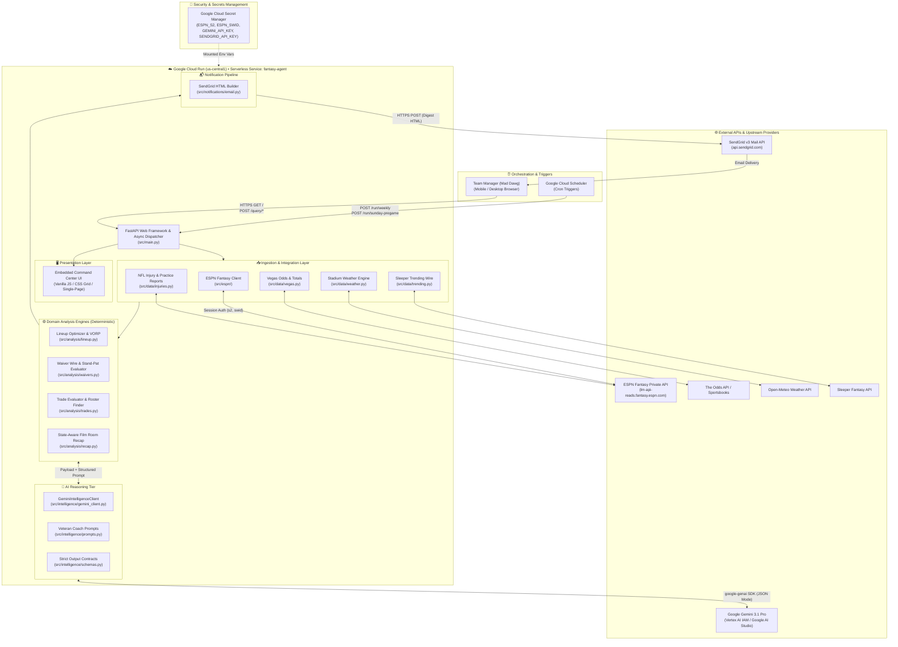
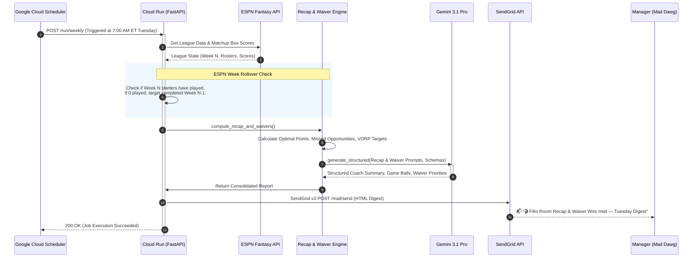
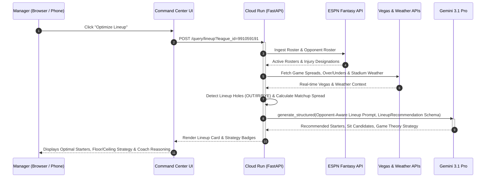

# 🏛️ System Architecture Specification

**System Name:** Mad Dawg's NFL Fantasy Football Intelligence Agent  
**Document Version:** 2.0 (Post-Gemini 3.1 Pro Migration)  
**Classification:** Event-Driven Serverless AI Agent & Decision-Support Platform  
**Target Platform:** Google Cloud Platform (`us-central1`)  
**Idle Operational Cost:** \$0.00 / month (100% GCP Free Tier Compliant)  

---

## 1. Executive Summary & Architectural Philosophy

The **NFL Fantasy Football Intelligence Agent** is an autonomous, event-driven decision-support platform designed to eliminate cognitive bias, emotional drafting, and suboptimal roster management across multiple competitive fantasy leagues.

### Core Architectural Principles
1. **Zero-Cost Serverless Execution:** Runs on Google Cloud Run configured with `min-instances=0`. Cold instances provision in <3 seconds on request and terminate immediately after processing, achieving \$0.00 idle cost.
2. **Hybrid Probabilistic-Deterministic Intelligence:** Core mathematical valuations (VORP, points differentials, starter replacement thresholds, injury status) are computed deterministically. The LLM (**Gemini 3.1 Pro**) is utilized strictly for contextual reasoning, game-script synthesis, game-theory weighting, and executive coaching commentary, constrained by strict Pydantic JSON schemas.
3. **Resilient Fail-Safe Operation:** If the LLM provider experiences network latency, rate limits, or service degradation, the engine seamlessly falls back to 100% deterministic optimization without crashing or missing automated weekly deadlines.
4. **State-Aware Temporal Dynamics:** Matchup analysis differentiates between `PRE_KICKOFF`, `IN_PROGRESS`, and `FINAL` game states. Tuesday morning routines automatically guard against ESPN week rollover race conditions.
5. **Zero Trust Security & Zero Hardcoded Secrets:** All credentials (ESPN session tokens, Gemini API keys, SendGrid API keys) are managed in Google Cloud Secret Manager and mounted as container environment variables at runtime.

---

## 2. System Topology & Context

> [!TIP]
> **Interactive Cloud Architecture Diagram**: An interactive, explorable **Archify** diagram with dark/light themes, pan/zoom, and animated trace paths is defined in [`docs/architecture.json`](docs/architecture.json) and compiled via GitHub Actions into [`docs/architecture.html`](docs/architecture.html).

The following diagram illustrates the high-level architecture, actors, external data providers, compute workloads, and notification sinks:



---

## 2. Detailed Component Breakdown

### 2.1 Ingestion & Integration Tier (`src/espn/`, `src/data/`)
* **ESPN Private API Client (`src/espn/client.py`):**
  * Communicates with ESPN's unofficial Fantasy v3 API via session cookies (`ESPN_S2` and `SWID`).
  * Ingests league settings, team rosters, matchup box scores, scoring schedules, waiver wire free agents, and transaction logs.
  * Encapsulates league configurations:
    * **PNA 2026 League (`991059191`):** 12-team, Full PPR, 4pt passing TD, 2-FLEX (RB/WR/TE), zero kickers.
    * **Chips Ahoy (`735288`):** 10-team, Full PPR, 6pt passing TD, 1-FLEX, 1 kicker.
* **Vegas Odds & Totals (`src/data/vegas.py`):**
  * Fetches real-time spreads, over/under totals, and implied team totals.
  * Translates implied totals into game-script probabilities (e.g., high-scoring shootouts favor WRs/QBs; positive-game-script favorites favor bellcow RBs).
* **Stadium Weather Engine (`src/data/weather.py`):**
  * Coordinates with geocoded NFL stadium coordinates.
  * Fetches temperature, wind speed, wind gusts, and precipitation probabilities.
  * Flags severe passing/kicking penalties when sustained winds exceed 18 mph or heavy precipitation is forecast.
* **Sleeper Trending Add/Drop Aggregator (`src/data/trending.py`):**
  * Ingests trending waiver wire activity across thousands of active fantasy leagues over rolling 24-hour windows.

---

### 2.2 Domain Analysis & Optimization Engines (`src/analysis/`)

```
                          ┌──────────────────────────┐
                          │   Raw Ingestion Inputs   │
                          │ Roster, Odds, Weather,   │
                          │   Injuries, Opponent     │
                          └─────────────┬────────────┘
                                        │
                                        ▼
                          ┌──────────────────────────┐
                          │ Deterministic Modeling   │
                          │ - VORP Calculation      │
                          │ - Lineup Hole Detection  │
                          │ - Ceiling/Floor Weights  │
                          │ - Stand-Pat Discipline   │
                          └─────────────┬────────────┘
                                        │
                         Matchup Context & Constraints
                                        ▼
                          ┌──────────────────────────┐
                          │ Gemini 3.1 Pro Reasoning │
                          │ - Opponent Counter-Strat │
                          │ - Game Script Synthesis  │
                          │ - Coach Narrative        │
                          └─────────────┬────────────┘
                                        │
                                Pydantic Contract
                                        ▼
                          ┌──────────────────────────┐
                          │ Final Output Delivery    │
                          │ - Web Command Center     │
                          │ - SendGrid HTML Digest   │
                          └──────────────────────────┘
```

#### A. Lineup Optimization Engine (`src/analysis/lineup.py`)
* **Hole Detection:** Proactively inspects all active roster slots for injured (`OUT`, `IR`, `DOUBTFUL`), suspended (`SUS`), or bye-week (`BYE`) players.
* **Game Theory Matchup Strategy:**
  * **HEAVY UNDERDOG:** Prioritizes high-variance, boom-or-bust players with elite target shares or deep-ball roles to maximize lineup ceiling.
  * **HEAVY FAVORITE:** Prioritizes high-floor, volume-secure players with guaranteed touch counts (bellcow RBs, target-hog slot WRs) to mitigate variance.
  * **BALANCED:** Standard optimal projection weighting against opponent counter-roster.

#### B. Waiver Wire & Stand-Pat Evaluator (`src/analysis/waivers.py`)
* Evaluates top available free agents against the manager's weakest bench assets using position-adjusted value over replacement (VORP).
* **Veteran Coach Stand-Pat Rule:** Enforces strict discipline: if the manager's bench possesses higher rest-of-season equity than available waiver options, the agent explicitly recommends `STAND_PAT` / `HOLD_ROSTER` rather than churning players for the sake of activity.

#### C. Trade Evaluation & Roster Upgrade Engine (`src/analysis/trades.py`, `src/analysis/trade_finder.py`)
* Evaluates proposals using a **Starting Lineup Delta** methodology instead of raw total bench points in a vacuum.
* Simulates the manager's starting 9-man lineup before and after the transaction to calculate net weekly expected points added.
* Factors in consolidation upgrades (2-for-1 trades) and roster slot value.

#### D. State-Aware Film Room Weekly Recap (`src/analysis/recap.py`)
* **3-State Temporal Classification:**
  1. `PRE_KICKOFF`: Starters have not played; presents preview projections and locks in starters without declaring premature winners or losers.
  2. `IN_PROGRESS`: Mid-week checkpoint (e.g., Thursday night through Sunday late games); evaluates completed games, highlights live margins, and details remaining requirements from unplayed starters.
  3. `FINAL`: Post-Monday Night Football retrospective; awards true Game Balls, highlights legitimate Busts, computes Bench Points Left (Missed Opportunities), and delivers strategic takeaways.
* **ESPN Week Rollover Safeguard:** Tuesday morning runs verify whether ESPN has advanced `current_week` before stats finalized; automatically retrieves the completed week ($N-1$) if unplayed games are detected.

---

### 2.3 Intelligence Layer & Prompt Orchestration (`src/intelligence/`)
* **Model Selection:** **`gemini-3.1-pro`** (Google's flagship reasoning model, replacing deprecated `gemini-2.5-pro`).
* **Client Architecture (`src/intelligence/gemini_client.py`):**
  * Employs the modern `google.genai` SDK (`genai.Client`).
  * Supports dual-authentication:
    * **Cloud Run Production:** Native Vertex AI IAM service account authentication (`vertexai=True`, `project=gen-lang-client-0581555372`, `location=us-central1`).
    * **Local Development / Fallback:** Google AI Studio direct API key via `GEMINI_API_KEY`.
* **Structured JSON Schema Enforcement:**
  * All analytical tasks pass Pydantic models (`LineupRecommendation`, `WaiverReport`, `TradeEvaluation`, `WeeklyRecapReport`) to `types.GenerateContentConfig(response_mime_type="application/json", response_schema=...)`.
  * Eliminates schema drift, hallucinations, and markdown wrapping errors.
* **Veteran Coach Persona (`src/intelligence/prompts.py`):**
  * System prompts instruct Gemini to act as a seasoned, analytical NFL head coach and fantasy expert.
  * Explicitly mandates conservative trade/waiver judgment and opponent-specific matchup strategies.

---

### 2.4 Event Automation & Cloud Scheduler Topology (`deploy/setup_scheduler.sh`)

Automated jobs run on Google Cloud Scheduler in the `us-central1` region using the `America/New_York` timezone:

| Job Identifier | Schedule (Cron) | Target Endpoint | Description |
| :--- | :--- | :--- | :--- |
| **`tuesday-film-room`** | `0 7 * * 2`<br>*(Tue 7:00 AM ET)* | `POST /run/weekly` | Generates post-MNF Film Room recap and prioritizes waiver wire claims before overnight processing. |
| **`thursday-tnf-lock`** | `50 18 * * 4`<br>*(Thu 6:50 PM ET)* | `POST /run/weekly` | Ingests official 90-minute TNF inactives, optimizes Thursday starters, and enforces FLEX slot discipline. |
| **`friday-injury-lock`** | `0 19 * * 5`<br>*(Fri 7:00 PM ET)* | `POST /run/weekly` | Evaluates final Friday injury designations (Out/Doubtful/Questionable) and sets the baseline weekend lineup. |
| **`sunday-gameday-inactives`** | `45 11,14 * * 0`<br>*(Sun 11:45 AM & 2:45 PM ET)* | `POST /run/sunday-pregame` | Ingests 90-min inactives for 1:00 PM and 4:05/4:25 PM slates, flags severe stadium weather, and alerts manager. |

---

### 2.5 Notification & Presentation Tier (`src/notifications/`, `src/main.py`)
* **SendGrid Responsive HTML Engine (`src/notifications/email.py`):**
  * Direct HTTP transmission using `httpx` to SendGrid's v3 Mail API.
  * Generates dark-mode responsive HTML digests including Game Balls, Bench Points Left, Matchup Win Probabilities, Lineup Hole warnings, and Actionable Coaching Takeaways.
* **Single-Page Command Center (`src/main.py`):**
  * Lightweight, fast-loading dashboard served directly by FastAPI.
  * Real-time AJAX interaction with zero heavy frontend build tools (no node_modules, webpack, or external framework dependencies).

---

## 3. End-to-End Execution Sequence Diagrams

### 3.1 Scheduled Tuesday Morning Film Room & Waiver Analysis Flow



---

### 3.2 On-Demand Real-Time Lineup Optimization Flow



---

## 4. Security & Secret Management

* **Zero Hardcoded Secrets:** No API keys, credentials, or tokens are committed to source control.
* **Google Cloud Secret Manager Mapping:**
  * `ESPN_S2`: ESPN user session authentication cookie.
  * `ESPN_SWID`: ESPN user identification UUID cookie.
  * `GEMINI_API_KEY`: API key for Google AI Studio (developer/local environments).
  * `SENDGRID_API_KEY`: SendGrid HTTP API key for digest distribution.
* **IAM Least Privilege:** In production on Cloud Run, the service runs under the default compute service account (`652912521571-compute@developer.gserviceaccount.com`), granted strictly:
  * `roles/secretmanager.secretAccessor` (access secret values).
  * `roles/aiplatform.user` (execute Vertex AI model predictions).

---

## 5. Resilience, Scalability & Disaster Recovery

1. **Deterministic Fallbacks:** In the event of an upstream Gemini API error (HTTP 429, 503, or rate limit exhaustion), the agent catches the exception, logs the event, and falls back to deterministic mathematical optimization. The scheduled email or web response will still generate with valid start/sit recommendations.
2. **Cold Start Optimization:** The Docker image uses `python:3.14-slim` with pre-compiled bytecode. Container boot time is ~1.8 seconds.
3. **Idempotent Deployments:** Deployment is fully scripted in `deploy/deploy.sh` and uses Google Cloud Build to build container images directly from source, eliminating local Docker daemon requirements.
4. **Automated Health Monitoring:**
   * Endpoint: `GET /health`
   * Validates active season, connected leagues, and current Gemini model version (`gemini-3.1-pro`).

---

## 6. Repository Layout & File Manifest

```
nfl-fantasy-football-agent/
├── ARCHITECTURE.md                  # System Architecture Specification (this file)
├── README.md                        # User Manual & Quick-Start Guide
├── Dockerfile                       # Production Container Definition
├── pyproject.toml                   # Python Package Dependencies & Metadata
├── deploy/
│   ├── deploy.sh                    # Automated Cloud Run Build & Deploy Script
│   ├── secrets.sh                   # Cloud Secret Manager Sync Script
│   └── setup_scheduler.sh           # Cloud Scheduler 4-Cron Setup Script
├── src/
│   ├── config.py                    # League Configurations & Environment Resolution
│   ├── main.py                      # FastAPI App, REST Endpoints & Web Dashboard
│   ├── analysis/                    # Deterministic Modeling & Decision Engines
│   │   ├── lineup.py                # VORP Lineup Optimizer & Hole Detection
│   │   ├── matchup_preview.py       # Opponent Matchup Breakdown
│   │   ├── recap.py                 # State-Aware Film Room Engine (3-State)
│   │   ├── trade_finder.py          # Proactive League Trade Opportunity Finder
│   │   ├── trades.py                # 2-for-1 & Starting Lineup Delta Evaluator
│   │   └── waivers.py               # Waiver Evaluator & Stand-Pat Enforcer
│   ├── data/                        # Upstream Aggregators
│   │   ├── injuries.py              # NFL Injury & Practice Report Parser
│   │   ├── stats.py                 # Historical & Weekly Stats Fetcher
│   │   ├── trending.py              # Sleeper Trending Wire Fetcher
│   │   ├── vegas.py                 # Vegas Spreads & Implied Totals
│   │   └── weather.py               # NFL Stadium Geocoding & Open-Meteo Weather
│   ├── espn/                        # ESPN Fantasy API Integration
│   │   ├── client.py                # Authenticated ESPN Client
│   │   ├── matchup.py               # Weekly Matchup & Box Score Extractor
│   │   └── roster.py                # Roster Parser & Position Normalizer
│   ├── intelligence/                # AI Intelligence Tier
│   │   ├── gemini_client.py         # Google GenAI / Vertex AI Client Wrapper
│   │   ├── prompts.py               # Veteran Coach Prompts & Game Theory Directives
│   │   └── schemas.py               # Strict Pydantic JSON Output Schemas
│   └── notifications/               # Email Distribution
│       └── email.py                 # SendGrid v3 HTML Digest Generator
└── tests/                           # Pytest Automated Test Suite (127 Unit Tests)
```
