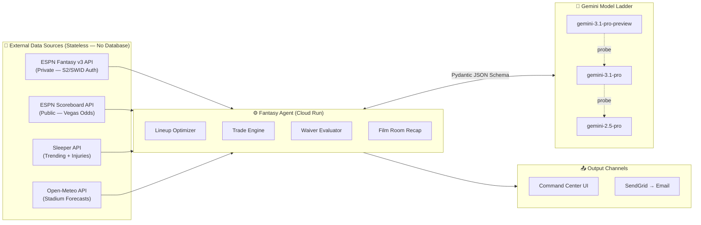
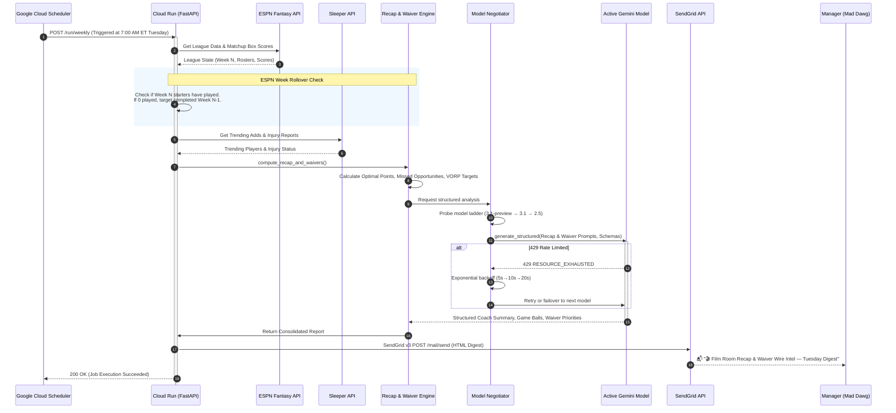
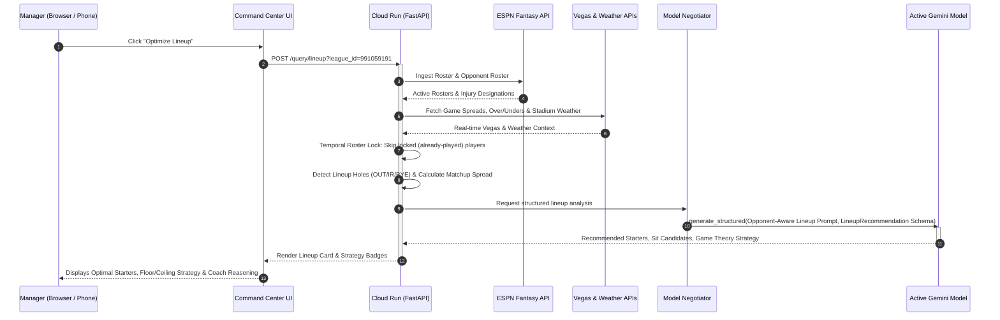
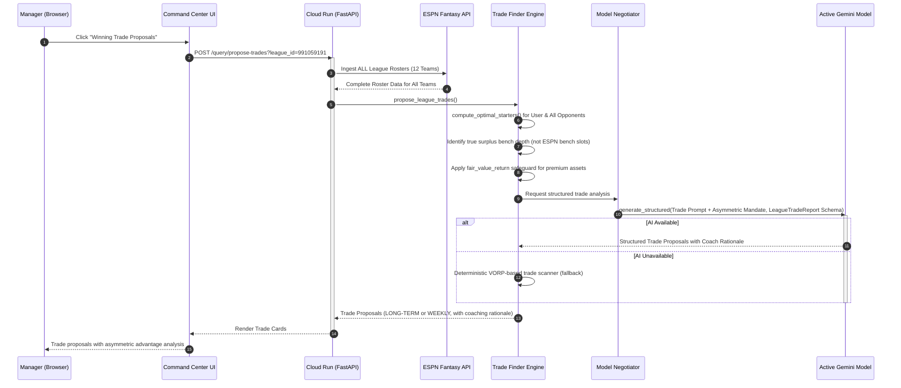

# 🏛️ System Architecture Specification

**System Name:** Mad Dawg's NFL Fantasy Football Intelligence Agent  
**Document Version:** 3.0 (Dynamic Model Negotiation Ladder, Holistic Trade Engine & Temporal Roster Lock)  
**Classification:** Event-Driven Serverless AI Agent & Decision-Support Platform  
**Target Platform:** Google Cloud Platform (`us-central1`)  
**Idle Operational Cost:** \$0.00 / month (100% GCP Free Tier Compliant)  

---

## 1. Executive Summary & Architectural Philosophy

The **NFL Fantasy Football Intelligence Agent** is an autonomous, event-driven decision-support platform designed to eliminate cognitive bias, emotional drafting, and suboptimal roster management across multiple competitive fantasy leagues.

### Core Architectural Principles
1. **Zero-Cost Serverless Execution:** Runs on Google Cloud Run configured with `min-instances=0`. Cold instances provision in <3 seconds on request and terminate immediately after processing, achieving \$0.00 idle cost.
2. **Hybrid Probabilistic-Deterministic Intelligence:** Core mathematical valuations (VORP, points differentials, starter replacement thresholds, injury status) are computed deterministically. The LLM (dynamically negotiated — currently **Gemini 2.5 Pro** with auto-upgrade probing for **Gemini 3.1 Pro**) is utilized strictly for contextual reasoning, game-script synthesis, game-theory weighting, and executive coaching commentary, constrained by strict Pydantic JSON schemas.
3. **Resilient Fail-Safe Operation:** If the LLM provider experiences network latency, rate limits (429 errors trigger exponential backoff retries), or service degradation, the engine seamlessly falls back to 100% deterministic optimization without crashing or missing automated weekly deadlines.
4. **State-Aware Temporal Dynamics:** Matchup analysis differentiates between `PRE_KICKOFF`, `IN_PROGRESS`, and `FINAL` game states. Tuesday morning routines automatically guard against ESPN week rollover race conditions. Temporal roster lock enforcement prevents stale recommendations for already-locked players.
5. **Zero Trust Security & Zero Hardcoded Secrets:** All credentials (ESPN session tokens, Gemini API keys, SendGrid API keys) are managed in Google Cloud Secret Manager and mounted as container environment variables at runtime.
6. **Holistic Roster Evaluation:** All trade and lineup analysis uses `compute_optimal_starters()` to evaluate rosters by true optimal lineup potential — never assuming that ESPN bench slot position reflects player value.
7. **Asymmetric Trade Advantage:** Trade proposals are mandated to benefit the manager disproportionately, with fair-value return safeguards for premium assets (≥13.0 pts refuse discounted returns).

---

## 2. System Topology & Context

<p align="center">
  <a href="docs/architecture.html">
    
  </a>
</p>

> [!TIP]
> **Interactive Cloud Architecture Diagram**: The diagram above is compiled by Archify. You can open the standalone [**Interactive Viewer (docs/architecture.html)**](docs/architecture.html) to explore dark/light themes, pan/zoom navigation, and filter between automated cadence vs. on-demand optimization views. Specification source: [`docs/architecture.json`](docs/architecture.json).

Below is the matching structural component mapping:

```mermaid
flowchart TB
    subgraph Trigger_Layer ["⏰ Orchestration & Triggers"]
        CS["Google Cloud Scheduler<br/>(4 Cron Triggers, ET)"]
        User["Team Manager (Mad Dawg)<br/>(Mobile / Desktop Browser)"]
    end

    subgraph GCP_Cloud_Run ["☁️ Google Cloud Run (us-central1) • Serverless Service: fantasy-agent"]
        direction TB
        FastAPI["FastAPI Engine & Async Dispatcher<br/>(src/main.py)"]
        
        subgraph Web_UI ["🖥️ Presentation Layer"]
            Dashboard["Embedded Command Center UI<br/>(Vanilla JS / CSS Grid / Single-Page)"]
            BrainBadge["Interactive 🧠 Brain Badge<br/>(Live Model Probe on Click)"]
        end

        subgraph Ingestion_Adapters ["📥 Ingestion & Integration Layer"]
            ESPNClient["ESPN Fantasy Client<br/>(src/espn/)"]
            VegasAdapter["Vegas Odds & Totals<br/>(src/data/vegas.py)"]
            WeatherAdapter["Stadium Weather Engine<br/>(src/data/weather.py)"]
            SleeperAdapter["Sleeper Trending Wire + Injuries<br/>(src/data/trending.py, injuries.py)"]
        end

        subgraph Core_Engines ["⚙️ Domain Analysis Engines"]
            LineupOpt["Lineup Optimizer & VORP<br/>(src/analysis/lineup.py)"]
            WaiverEval["Waiver Wire & Stand-Pat Evaluator<br/>(src/analysis/waivers.py)"]
            RecapEngine["State-Aware Film Room Recap<br/>(src/analysis/recap.py)"]
        end

        subgraph Trade_Layer ["🔄 Holistic Trade Engine"]
            TradeFinder["League Trade Scanner<br/>(src/analysis/trade_finder.py)"]
            TradeEval["VORP Delta & Starter Lineup Evaluator<br/>(src/analysis/trades.py)"]
            OptimalStarters["compute_optimal_starters()<br/>(Anti-Bench-Assumption Engine)"]
        end

        subgraph AI_Intelligence ["🧠 AI Reasoning Tier"]
            GeminiClient["GeminiIntelligenceClient<br/>(src/intelligence/gemini_client.py)"]
            ModelNegotiator["Model Negotiator<br/>(Auto-Probe + 429 Retry)"]
            PromptStore["Veteran Coach Prompts<br/>(src/intelligence/prompts.py)"]
            PydanticSchemas["Strict Output Contracts<br/>(src/intelligence/schemas.py)"]
        end

        subgraph Deterministic_Fallback ["🛡️ Deterministic Fallback"]
            RulesEngine["Rules Engine (No-AI Safe)<br/>(VORP Scanner + Fair-Value Guard)"]
        end

        subgraph Notification_Tier ["📬 Notification Pipeline"]
            EmailEngine["SendGrid HTML Builder<br/>(src/notifications/email.py)"]
        end
    end

    subgraph External_Services ["🌐 External APIs & Upstream Providers"]
        ESPN_API["ESPN Fantasy Private API<br/>(lm-api-reads.fantasy.espn.com)"]
        Gemini_31_Preview["gemini-3.1-pro-preview<br/>(Primary Target — Preview)"]
        Gemini_31_Pro["gemini-3.1-pro<br/>(GA Alias)"]
        Gemini_25_Pro["gemini-2.5-pro<br/>(Stable Fallback — Active)"]
        SendGrid_API["SendGrid v3 Mail API<br/>(api.sendgrid.com)"]
        Odds_API["ESPN Scoreboard API<br/>(Vegas Spreads & Totals)"]
        Weather_API["Open-Meteo Weather API"]
        Sleeper_API["Sleeper Fantasy API"]
    end

    subgraph Security_Config ["🔐 Security & Secrets Management"]
        GSM["Google Cloud Secret Manager<br/>(ESPN_S2, ESPN_SWID, GEMINI_API_KEY, SENDGRID_API_KEY)"]
    end

    %% Trigger Connections
    CS -->|"POST /run/weekly<br/>POST /run/sunday-pregame"| FastAPI
    User -->|"HTTPS GET /<br/>POST /query/*"| FastAPI

    %% Ingestion Connections
    FastAPI --> Ingestion_Adapters
    ESPNClient <-->|"Session Auth (s2, swid)"| ESPN_API
    VegasAdapter <--> Odds_API
    WeatherAdapter <--> Weather_API
    SleeperAdapter <--> Sleeper_API

    %% Core Engine & AI Flow
    Ingestion_Adapters --> Core_Engines
    Ingestion_Adapters --> Trade_Layer
    Core_Engines <-->|"Payload + Structured Prompt"| AI_Intelligence
    Trade_Layer <-->|"Holistic Roster Data"| AI_Intelligence

    %% Model Negotiation Ladder
    ModelNegotiator -->|"probe 1st"| Gemini_31_Preview
    ModelNegotiator -->|"probe 2nd"| Gemini_31_Pro
    ModelNegotiator -->|"stable fallback"| Gemini_25_Pro

    %% Fallback Path
    Core_Engines -->|"on AI failure"| Deterministic_Fallback
    Trade_Layer -->|"on AI failure"| Deterministic_Fallback

    %% Notification Flow
    Core_Engines --> Notification_Tier
    Notification_Tier -->|"HTTPS POST (Digest HTML)"| SendGrid_API
    SendGrid_API -->|"Email Delivery"| User

    %% Web UI Response
    FastAPI --> Dashboard
    GSM -.->|"Mounted Env Vars"| GCP_Cloud_Run
```



---

## 2a. API Endpoints & Data Flow

<p align="center">
  <a href="docs/api-data-flow.html">
    
  </a>
</p>

> [!TIP]
> **Interactive API & Data Flow Diagram**: Open the standalone [**Interactive Viewer (docs/api-data-flow.html)**](docs/api-data-flow.html) for dark/light themes and filtered views. Specification source: [`docs/api-data-flow.json`](docs/api-data-flow.json).

### Complete Endpoint Map

| Method(s) | Path | Parameters | Description |
| :--- | :--- | :--- | :--- |
| `GET` | `/` | — | Serves the single-page Command Center HTML dashboard |
| `GET` | `/health` | `check_gemini: bool` | System status, season, active model, connected leagues |
| `GET` | `/health/models` | `force: bool` | Live Gemini model probe & auto-upgrade diagnostics |
| `GET`, `POST` | `/run/weekly` | — | Multi-day automation (Tue: Film Room + Waivers, Thu: TNF, Fri: Injury Lock) |
| `GET`, `POST` | `/run/sunday-pregame` | — | Sunday pregame: inactives, weather, spreads, starter alerts |
| `POST` | `/query/start-sit` | `league_id: int` | On-demand Start 'Em / Sit 'Em with game-theory strategy |
| `POST` | `/query/lineup` | `league_id: int` | Alias for start-sit |
| `GET` | `/query/roster-players` | `league_id: int` | Quick-select roster player list for trade builder UI |
| `POST` | `/query/trade` | Body: `TradeRequest` | VORP delta trade evaluation (ACCEPT / REJECT / COUNTER) |
| `POST` | `/query/propose-trades` | `league_id: int` | Proactive league-wide trade scanner with asymmetric mandate |
| `POST` | `/query/waivers` | `league_id: int` | Waiver wire analysis with Sleeper trending cross-reference |
| `GET`, `POST` | `/query/weekly-recap` | `league_id: int`, `week: int?` | Post-game Film Room (3-state temporal: PRE/IN_PROGRESS/FINAL) |

### Data Flow: External API Integrations



> [!IMPORTANT]
> **Fully Stateless Architecture:** This system does NOT use Firebase, Firestore, or any database. All data is fetched live from upstream APIs on every request. The `google-cloud-firestore` dependency exists in `pyproject.toml` as an optional GCP extra but is never imported or initialized.

---

## 2. Detailed Component Breakdown

### 2.1 Ingestion & Integration Tier (`src/espn/`, `src/data/`)
* **ESPN Private API Client (`src/espn/client.py`):**
  * Communicates with ESPN's unofficial Fantasy v3 API via session cookies (`ESPN_S2` and `SWID`).
  * Ingests league settings, team rosters, matchup box scores, scoring schedules, waiver wire free agents, and transaction logs.
  * Encapsulates league configurations:
    * **PNA 2026 League (`991059191`):** 12-team, Full PPR, 4pt passing TD, 2-FLEX (RB/WR/TE), zero kickers.
    * **Chips Ahoy (`735288`):** 10-team, Full PPR, 6pt passing TD, 1-FLEX, 1 kicker.
* **Vegas Odds & Totals (`src/data/vegas.py`):**
  * Fetches real-time spreads, over/under totals, and implied team totals from ESPN Scoreboard API.
  * Translates implied totals into game-script probabilities (e.g., high-scoring shootouts favor WRs/QBs; positive-game-script favorites favor bellcow RBs).
* **Stadium Weather Engine (`src/data/weather.py`):**
  * Coordinates with geocoded NFL stadium coordinates.
  * Fetches temperature, wind speed, wind gusts, and precipitation probabilities from Open-Meteo.
  * Flags severe passing/kicking penalties when sustained winds exceed 18 mph or heavy precipitation is forecast.
* **Sleeper Trending Add/Drop Aggregator (`src/data/trending.py`):**
  * Ingests trending waiver wire activity across thousands of active fantasy leagues over rolling 24-hour windows.
* **NFL Injury & Practice Reports (`src/data/injuries.py`):**
  * Fetches player injury status and practice participation (DNP/LP/FP) from Sleeper's player metadata.

---

### 2.2 Domain Analysis & Optimization Engines (`src/analysis/`)

```
                          ┌──────────────────────────┐
                          │   Raw Ingestion Inputs   │
                          │ Roster, Odds, Weather,   │
                          │   Injuries, Opponent     │
                          └─────────────┬────────────┘
                                        │
                                        ▼
                          ┌──────────────────────────┐
                          │ Temporal Roster Lock      │
                          │ - Skip locked players    │
                          │ - Game state awareness   │
                          └─────────────┬────────────┘
                                        │
                                        ▼
                          ┌──────────────────────────┐
                          │ Deterministic Modeling   │
                          │ - VORP Calculation       │
                          │ - Lineup Hole Detection  │
                          │ - Ceiling/Floor Weights  │
                          │ - Stand-Pat Discipline   │
                          │ - Optimal Starters Calc  │
                          └─────────────┬────────────┘
                                        │
                         Matchup Context & Constraints
                                        ▼
                          ┌──────────────────────────┐
                          │ Gemini Model Negotiator  │
                          │ - Probe 3.1-pro-preview  │
                          │ - Probe 3.1-pro          │
                          │ - Fallback 2.5-pro       │
                          │ - 429 Retry (5s→10s→20s) │
                          └─────────────┬────────────┘
                                        │
                                Pydantic Contract
                                        ▼
                          ┌──────────────────────────┐
                          │ Final Output Delivery    │
                          │ - Web Command Center     │
                          │ - SendGrid HTML Digest   │
                          └──────────────────────────┘
```

#### A. Lineup Optimization Engine (`src/analysis/lineup.py`)
* **Temporal Roster Lock:** Filters out players whose games have already started (Thursday night, early Sunday, etc.) from recommendation scope.
* **Hole Detection:** Proactively inspects all active roster slots for injured (`OUT`, `IR`, `DOUBTFUL`), suspended (`SUS`), or bye-week (`BYE`) players.
* **Game Theory Matchup Strategy:**
  * **HEAVY UNDERDOG:** Prioritizes high-variance, boom-or-bust players with elite target shares or deep-ball roles to maximize lineup ceiling.
  * **HEAVY FAVORITE:** Prioritizes high-floor, volume-secure players with guaranteed touch counts (bellcow RBs, target-hog slot WRs) to mitigate variance.
  * **BALANCED:** Standard optimal projection weighting against opponent counter-roster.

#### B. Waiver Wire & Stand-Pat Evaluator (`src/analysis/waivers.py`)
* Evaluates top available free agents against the manager's weakest bench assets using position-adjusted value over replacement (VORP).
* **Veteran Coach Stand-Pat Rule:** Enforces strict discipline: if the manager's bench possesses higher rest-of-season equity than available waiver options, the agent explicitly recommends `STAND_PAT` / `HOLD_ROSTER` rather than churning players for the sake of activity.

#### C. Trade Evaluation & Roster Upgrade Engine (`src/analysis/trades.py`, `src/analysis/trade_finder.py`)
* **Holistic Roster Evaluation:** Uses `compute_optimal_starters()` to calculate true optimal starting lineups for both the user and all opponents — never assumes ESPN bench slot position reflects player value.
* **Anti-Bench Assumption Mandate:** Players in bench slots are not treated as less valuable; instead, the engine evaluates all roster players by their projected points and positional scarcity.
* **Asymmetric Advantage Mandate:** All trade proposals must benefit Mad Dawg disproportionately, with explicit coaching rationale for why the trade is advantageous.
* **Fair-Value Return Safeguard:** When the user gives up a premium asset (≥13.0 projected points), the engine refuses discounted returns — the opponent's asset must be within 2.5 points of fair value.
* **Starting Lineup Delta:** Evaluates proposals by simulating the manager's starting lineup before and after the transaction to calculate net weekly expected points added.
* **Time Horizon Awareness:** Trade recommendations specify whether the value is **WEEKLY** (tactical, this-week advantage) or **LONG-TERM** (rest-of-season equity).

#### D. State-Aware Film Room Weekly Recap (`src/analysis/recap.py`)
* **3-State Temporal Classification:**
  1. `PRE_KICKOFF`: Starters have not played; presents preview projections and locks in starters without declaring premature winners or losers.
  2. `IN_PROGRESS`: Mid-week checkpoint (e.g., Thursday night through Sunday late games); evaluates completed games, highlights live margins, and details remaining requirements from unplayed starters.
  3. `FINAL`: Post-Monday Night Football retrospective; awards true Game Balls, highlights legitimate Busts, computes Bench Points Left (Missed Opportunities), and delivers strategic takeaways.
* **ESPN Week Rollover Safeguard:** Tuesday morning runs verify whether ESPN has advanced `current_week` before stats finalized; automatically retrieves the completed week ($N-1$) if unplayed games are detected.

---

### 2.3 Intelligence Layer & Prompt Orchestration (`src/intelligence/`)

* **Dynamic Model Negotiation (`negotiate_active_model()`):**
  * At startup and on-demand via `/health/models?force=true`, probes each model in the preference ladder:
    1. `gemini-3.1-pro-preview` (Primary Target — Preview)
    2. `gemini-3.1-pro` (GA Alias)
    3. `gemini-3-pro-preview` (Secondary Preview)
    4. `gemini-2.5-pro` (Stable Fallback — EOL October 2026)
  * Result cached in `_NEGOTIATED_MODEL`. Interactive 🧠 Brain Badge in the UI displays the active model with color-coded status (green = target, amber = fallback).
* **429 Exponential Backoff Retry:**
  * Rate-limit errors (HTTP 429 / `RESOURCE_EXHAUSTED`) trigger up to 3 retries with exponential backoff (5s → 10s → 20s) before failing over to the next model in the ladder.
* **Client Architecture (`src/intelligence/gemini_client.py`):**
  * Employs the modern `google.genai` SDK (`genai.Client`).
  * Supports dual-authentication:
    * **Cloud Run Production:** Native Vertex AI IAM service account authentication (`vertexai=True`, `project=gen-lang-client-0581555372`, `location=us-central1`).
    * **Local Development / Fallback:** Google AI Studio direct API key via `GEMINI_API_KEY`.
* **Structured JSON Schema Enforcement:**
  * All analytical tasks pass Pydantic models (`LineupRecommendation`, `WaiverReport`, `TradeEvaluation`, `WeeklyRecapReport`, `LeagueTradeReport`) to `types.GenerateContentConfig(response_mime_type="application/json", response_schema=...)`.
  * Eliminates schema drift, hallucinations, and markdown wrapping errors.
* **Veteran Coach Persona (`src/intelligence/prompts.py`):**
  * System prompts instruct Gemini to act as a seasoned, analytical NFL head coach and fantasy expert.
  * Includes critical mandates:
    * **Anti-Bench-Assumption Mandate:** Never treat bench position as an indicator of player value.
    * **Asymmetric Advantage Mandate:** All trade proposals must favor Mad Dawg disproportionately.
    * **Value Asymmetry & Leverage Mandate:** Exploit positional scarcity and surplus depth.

---

### 2.4 Event Automation & Cloud Scheduler Topology (`deploy/setup_scheduler.sh`)

Automated jobs run on Google Cloud Scheduler in the `us-central1` region using the `America/New_York` timezone:

| Job Identifier | Schedule (Cron) | Target Endpoint | Description |
| :--- | :--- | :--- | :--- |
| **`tuesday-film-room`** | `0 7 * * 2`<br>*(Tue 7:00 AM ET)* | `POST /run/weekly` | Generates post-MNF Film Room recap and prioritizes waiver wire claims before overnight processing. |
| **`thursday-tnf-lock`** | `50 18 * * 4`<br>*(Thu 6:50 PM ET)* | `POST /run/weekly` | Ingests official 90-minute TNF inactives, optimizes Thursday starters, and enforces FLEX slot discipline. |
| **`friday-injury-lock`** | `0 19 * * 5`<br>*(Fri 7:00 PM ET)* | `POST /run/weekly` | Evaluates final Friday injury designations (Out/Doubtful/Questionable) and sets the baseline weekend lineup. |
| **`sunday-gameday-inactives`** | `45 11,14 * * 0`<br>*(Sun 11:45 AM & 2:45 PM ET)* | `POST /run/sunday-pregame` | Ingests 90-min inactives for 1:00 PM and 4:05/4:25 PM slates, flags severe stadium weather, and alerts manager. |

---

### 2.5 Notification & Presentation Tier (`src/notifications/`, `src/main.py`)
* **SendGrid Responsive HTML Engine (`src/notifications/email.py`):**
  * Direct HTTP transmission using `httpx` to SendGrid's v3 Mail API.
  * Generates dark-mode responsive HTML digests including Game Balls, Bench Points Left, Matchup Win Probabilities, Lineup Hole warnings, and Actionable Coaching Takeaways.
  * Sends failure alert emails when critical errors occur during scheduled runs.
* **Single-Page Command Center (`src/main.py`):**
  * Lightweight, fast-loading dashboard served directly by FastAPI.
  * Real-time AJAX interaction with zero heavy frontend build tools (no node_modules, webpack, or external framework dependencies).
  * **Interactive 🧠 Brain Badge:** Clickable badge triggers live model re-probe (`/health/models?force=true`), displays active model with color-coded status (green/amber).
  * **System Health Badge:** Real-time API connectivity indicator.

---

## 3. End-to-End Execution Sequence Diagrams

### 3.1 Scheduled Tuesday Morning Film Room & Waiver Analysis Flow



---

### 3.2 On-Demand Real-Time Lineup Optimization Flow



---

### 3.3 Proactive Trade Proposal Flow



---

## 4. Security & Secret Management

* **Zero Hardcoded Secrets:** No API keys, credentials, or tokens are committed to source control.
* **Google Cloud Secret Manager Mapping:**
  * `ESPN_S2`: ESPN user session authentication cookie.
  * `ESPN_SWID`: ESPN user identification UUID cookie.
  * `GEMINI_API_KEY`: API key for Google AI Studio (developer/local environments).
  * `SENDGRID_API_KEY`: SendGrid HTTP API key for digest distribution.
* **IAM Least Privilege:** In production on Cloud Run, the service runs under the default compute service account (`652912521571-compute@developer.gserviceaccount.com`), granted strictly:
  * `roles/secretmanager.secretAccessor` (access secret values).
  * `roles/aiplatform.user` (execute Vertex AI model predictions).

---

## 5. Resilience, Scalability & Disaster Recovery

1. **Dynamic Model Failover with 429 Retry:** Rate-limit errors trigger exponential backoff retries (5s → 10s → 20s, up to 3 attempts) before failing over to the next model in the negotiation ladder. Full model unavailability triggers deterministic fallback.
2. **Deterministic Fallbacks:** In the event of total upstream Gemini API failure, the agent falls back to deterministic mathematical optimization (VORP-based scanner, fair-value guard). Scheduled emails and web responses still generate with valid recommendations.
3. **Cold Start Optimization:** The Docker image uses `python:3.14-slim` with pre-compiled bytecode. Container boot time is ~1.8 seconds.
4. **Idempotent Deployments:** Deployment is fully scripted in `deploy/deploy.sh` and uses Google Cloud Build to build container images directly from source, eliminating local Docker daemon requirements.
5. **Automated Health Monitoring & Probing:**
   * `GET /health` — Validates active season, connected leagues, model version, and connectivity status.
   * `GET /health/models` — Live probe of all models in the negotiation ladder with force re-negotiate option.
   * Interactive 🧠 Brain Badge in the UI triggers live model re-probe on click.
6. **Error Alert Emails:** Critical failures during scheduled runs dispatch failure alert emails via SendGrid, ensuring the manager is always aware of system issues.

---

## 6. Repository Layout & File Manifest

```
nfl-fantasy-football-agent/
├── ARCHITECTURE.md                  # System Architecture Specification (this file)
├── README.md                        # User Manual & Quick-Start Guide
├── Dockerfile                       # Production Container Definition
├── pyproject.toml                   # Python Package Dependencies & Metadata
├── deploy/
│   ├── deploy.sh                    # Automated Cloud Run Build & Deploy Script
│   ├── secrets.sh                   # Cloud Secret Manager Sync Script
│   └── setup_scheduler.sh           # Cloud Scheduler 4-Cron Setup Script
├── docs/
│   ├── architecture.json            # Archify Spec: System Architecture Diagram
│   ├── architecture.html            # Archify Rendered: Interactive Architecture Viewer
│   ├── architecture.svg             # Archify Rendered: Standalone SVG (GitHub Embed)
│   ├── api-data-flow.json           # Archify Spec: API & Data Flow Diagram
│   ├── api-data-flow.html           # Archify Rendered: Interactive API Flow Viewer
│   └── api-data-flow.svg            # Archify Rendered: Standalone SVG (GitHub Embed)
├── src/
│   ├── config.py                    # League Configurations & Environment Resolution
│   ├── main.py                      # FastAPI App, REST Endpoints, Web Dashboard & Brain Badge
│   ├── analysis/                    # Deterministic Modeling & Decision Engines
│   │   ├── lineup.py                # VORP Lineup Optimizer, Hole Detection & Temporal Lock
│   │   ├── matchup_preview.py       # Opponent Matchup Breakdown
│   │   ├── recap.py                 # State-Aware Film Room Engine (3-State)
│   │   ├── scoring.py               # Custom Scoring Calculation from ESPN Stat IDs
│   │   ├── trade_finder.py          # Proactive League Trade Scanner (Holistic + Asymmetric)
│   │   ├── trades.py                # Starting Lineup Delta, VORP & Optimal Starters Engine
│   │   └── waivers.py               # Waiver Evaluator & Stand-Pat Enforcer
│   ├── data/                        # Upstream Aggregators
│   │   ├── injuries.py              # NFL Injury & Practice Report Parser (via Sleeper)
│   │   ├── stats.py                 # Historical & Weekly Stats Fetcher
│   │   ├── trending.py              # Sleeper Trending Wire Fetcher
│   │   ├── vegas.py                 # Vegas Spreads & Implied Totals (via ESPN Scoreboard)
│   │   └── weather.py               # NFL Stadium Geocoding & Open-Meteo Weather
│   ├── espn/                        # ESPN Fantasy API Integration
│   │   ├── client.py                # Authenticated ESPN Client
│   │   ├── matchup.py               # Weekly Matchup & Box Score Extractor
│   │   └── roster.py                # Roster Parser & Position Normalizer
│   ├── intelligence/                # AI Intelligence Tier
│   │   ├── gemini_client.py         # Google GenAI / Vertex AI Client (Model Negotiation + 429 Retry)
│   │   ├── prompts.py               # Veteran Coach Prompts, Anti-Bench & Asymmetric Mandates
│   │   └── schemas.py               # Strict Pydantic JSON Output Schemas (6 Models)
│   └── notifications/               # Email Distribution
│       └── email.py                 # SendGrid v3 HTML Digest Generator & Failure Alerts
└── tests/                           # Pytest Automated Test Suite (151 Unit Tests)
```
